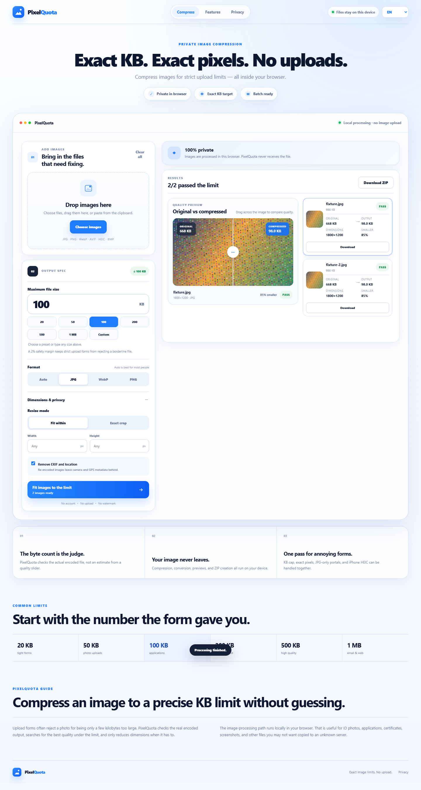
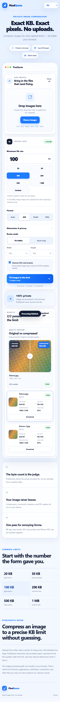

# PixelQuota

<div align="center">

**Hit exact image upload limits without uploading your images.**

Compress to a target **KB size**, resize to exact **pixel dimensions**, convert formats, batch-process files, and keep the entire image pipeline inside your browser.

[**Live Demo**](https://kane1a.github.io/PixelQuota/) · [繁體中文](README.zh-TW.md) · [Quick start](#quick-start) · [Privacy](#privacy) · [Contributing](CONTRIBUTING.md)


</div>



## Why PixelQuota?

A lot of image tools are built around a quality slider. Upload forms are not.

Government portals, job applications, school forms, ID-photo systems, email gateways, and CMS uploads often ask for rules such as **“under 100 KB”**, **“exactly 600×600 px”**, or **“JPG only.”** PixelQuota is built around those constraints directly.

It checks the **real encoded byte size**, searches for the highest quality that fits, and explains when a target cannot be reached instead of silently giving you the wrong dimensions.

## Highlights

| Feature | What it does |
| --- | --- |
| Exact KB target | Fits images under a chosen limit with a 2% safety margin for strict upload forms. |
| Custom size | Use presets such as 20 / 50 / 100 / 200 / 500 KB / 1 MB, or enter any KB value. |
| Exact dimensions | Keep a required pixel size or fit within width/height limits. |
| Clear failure reasons | Explains why a file cannot meet the requested KB, format, and dimensions together. |
| Private by design | Image bytes stay in the browser. PixelQuota has no image-upload endpoint. |
| Batch workflow | Process up to 30 images and download the results as a ZIP. |
| Format conversion | JPG, PNG, WebP, AVIF, HEIC/HEIF, and BMP input; JPG, PNG, WebP, or automatic output. |
| Metadata removal | Re-encoded images can drop EXIF and location metadata. |
| Safe repeat processing | Clicking Process again with unchanged settings skips finished files; changing settings reprocesses from the original. |
| English + Traditional Chinese | Full UI localization, including errors and dynamic processing states. |
| One-file local build | `dist/PixelQuota.html` can be opened directly without a server. |

## Screenshots

<table>
<tr>
<td width="72%"></td>
<td width="28%"></td>
</tr>
</table>

## Quick start

```bash
npm ci
npm run dev
```

Then open the local Vite URL shown in your terminal.

### Production build

```bash
npm run build
```

The build creates two useful entry points:

- `dist/index.html` — static-host / GitHub Pages entry.
- `dist/PixelQuota.html` — self-contained local app that can be opened by double-clicking.

### Browser test

```bash
npm run test:e2e
```

The test opens the real built app in Chrome/Chromium and verifies localization, common/custom KB controls, repeated-processing safety, changed-setting reprocessing, localized failure reasons, download behavior, responsive layouts, and typography in both English and Traditional Chinese.

If Chrome is not in a standard location, set `CHROME_PATH` first.

## GitHub Pages

The live app is available at **https://kane1a.github.io/PixelQuota/**.

This repository deploys through `.github/workflows/pages.yml`. Every push to `main` builds and publishes `dist/` automatically.

## How it works

PixelQuota uses browser image APIs to decode and re-encode images, then searches output quality against the requested byte budget. When quality alone cannot satisfy the limit, the non-exact resize mode can reduce dimensions progressively. Exact-dimension mode treats width and height as hard requirements and reports a clear failure when the file cannot satisfy all constraints together.

HEIC/HEIF decoding is handled by `heic2any`, and ZIP creation uses `fflate`.

## Privacy

PixelQuota is designed so the image-processing path runs locally in the browser.

- No image-upload API.
- No account required.
- No watermark.
- Selected image bytes are not sent to PixelQuota.
- Optional advertising or sponsorship configuration is separate from the image-processing path.

For sensitive documents, always verify the environment where you are running any browser tool and review the source if your use case requires it.

## Supported browsers

PixelQuota targets current desktop and mobile browsers with modern Canvas, Blob, File, and Web APIs. Chrome/Chromium is used for the automated end-to-end test suite.

## Project structure

```text
src/                 App logic, compression engine, localization, styles
public/              Static configuration and privacy page
scripts/             Production post-build packaging
tests/               Browser end-to-end validation
docs/images/         README screenshots
.github/             CI, Pages deployment, issue and PR templates
```

## Contributing

Issues and pull requests are welcome. Start with [CONTRIBUTING.md](CONTRIBUTING.md).

Please **do not attach private ID photos, forms, certificates, or other sensitive images** to public issues. Reproduce bugs with non-sensitive sample files instead.

## License

PixelQuota is released under the [MIT License](LICENSE).
