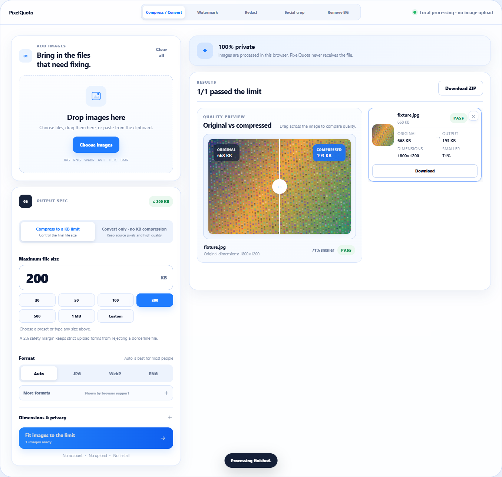
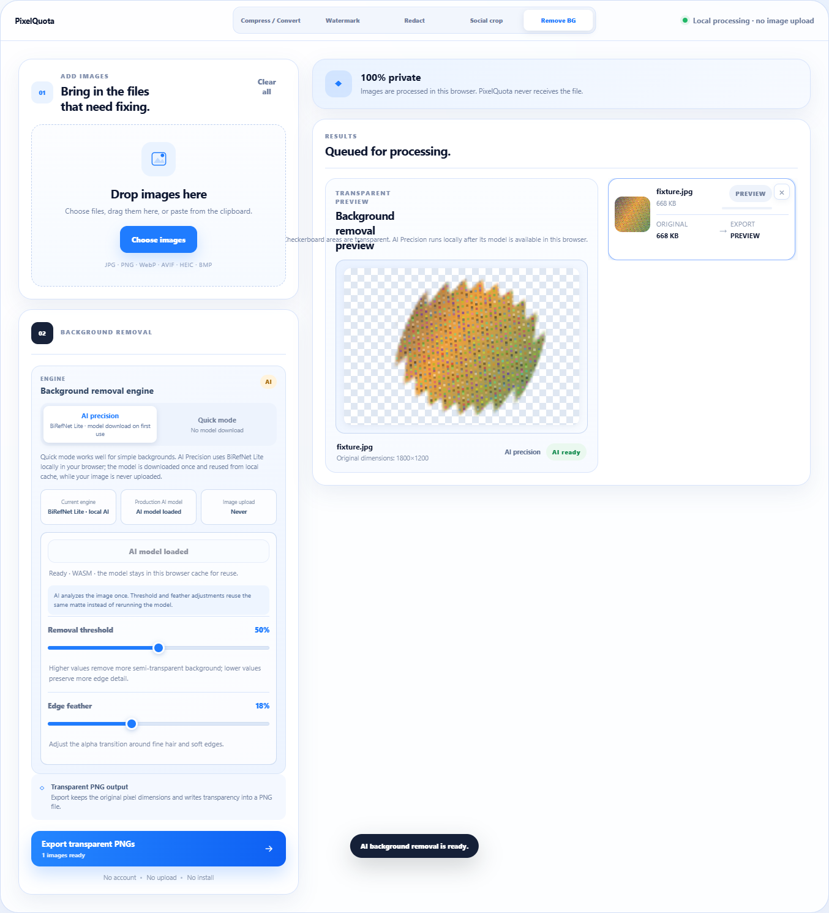
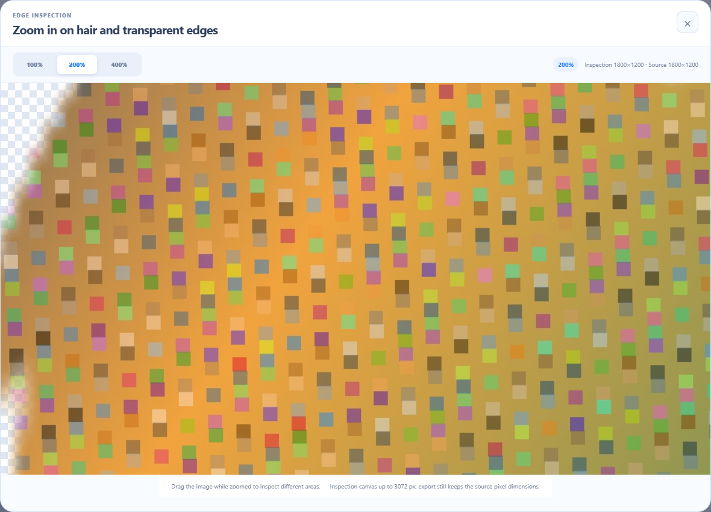

# PixelQuota

<div align="center">

**Private image tools. Right in your browser.**

Compress or convert images, add watermarks, redact sensitive regions, crop for social platforms, and remove backgrounds — without uploading your image files to PixelQuota.

[**Live Demo**](https://kane1a.github.io/PixelQuota/) · [繁體中文](README.zh-TW.md) · [Changelog](CHANGELOG.md) · [Privacy](#privacy) · [Contributing](CONTRIBUTING.md)


</div>



## Five tools, one local workflow

| Tool | What it does |
| --- | --- |
| Compress / Convert | Fit a real KB limit, resize to exact or maximum pixel dimensions, or convert formats without forcing compression. |
| Watermark | Add text and/or image watermarks with live preview, position, opacity, size, alignment, and full-resolution export. |
| Redact | Draw pixelate, blur, or solid-block regions; move/resize them, undo/redo edits, then compare the exported result with the original. |
| Social Crop | Pick a platform size, then frame the crop yourself instead of relying on a guessed focal point. |
| Remove Background | Use a quick local mode or BiRefNet Lite AI, refine transparency edges, and inspect hair/fine boundaries with an enlarged preview. |

## Built for annoying upload rules

PixelQuota still keeps the workflow that started the project: strict forms that say **“under 100 KB”**, **“600×600 px”**, or **“JPG only.”** It checks the actual encoded bytes, searches for the best result under the requested limit, and reports when the requested size, format, and dimensions cannot all be satisfied together.

Conversion-only mode is separate from KB compression, so a user who only needs JPG / PNG / WebP / AVIF / BMP output does not have to degrade an image just to change formats.

## Local AI background removal

AI Precision uses **BiRefNet Lite 512** in the browser. On first use, the browser downloads the model files and stores them in a local IndexedDB cache. Later refreshes can reload those cached weights instead of downloading them again.

The important privacy boundary is simple: **model files may use the network; selected image bytes do not.** PixelQuota does not send the image to an inference API.

BiRefNet Lite predicts a fixed-size alpha matte. PixelQuota reuses that matte for threshold and feather adjustments instead of rerunning the model on every slider movement, then composites the final transparent PNG at the source image's pixel dimensions. The enlarged edge-inspection view also reuses the same matte and does not trigger another AI inference.

<table>
<tr>
<td width="50%"></td>
<td width="50%"></td>
</tr>
</table>

## Formats

**Input:** common browser-decodable image formats, plus explicit HEIC / HEIF conversion support. Current browsers typically cover JPG, PNG, WebP, AVIF, and BMP; actual decode support can vary by browser.

**Output:** JPG, PNG, WebP, BMP, and AVIF. AVIF export uses a bundled local WebAssembly encoder instead of depending on browser canvas AVIF support, so it remains a real AVIF file without uploading image bytes or silently falling back to another format. Automatic output selection is also available.

HEIC / HEIF decoding uses `heic2any`. AVIF encoding uses the bundled `@jsquash/avif` WebAssembly codec. ZIP creation uses `fflate`.

## Privacy

- No image-upload endpoint.
- No account required.
- Compression, conversion, watermarking, redaction, cropping, previews, ZIP creation, and background-removal composition run on the device.
- AI background removal may download model files on first use; image bytes remain local.
- Re-encoded outputs can remove EXIF / GPS metadata.
- Optional advertising or sponsorship configuration is separate from selected image bytes.

See the in-app [Privacy page](https://kane1a.github.io/PixelQuota/privacy.html) for the user-facing privacy explanation.

## Quick start

```bash
npm ci
npm run dev
```

Then open the local Vite URL shown in your terminal.

### Production build

```bash
npm run build
```

The build creates:

- `dist/index.html` — static-host / GitHub Pages entry.
- `dist/PixelQuota.html` — self-contained standalone build that can be opened directly.

### Browser validation

```bash
npm run test:e2e
```

The Chrome/Chromium suite covers compression, conversion, format capability gating, watermarking, redaction editing/comparison, manual social crop, background-removal workflows, AI matte reuse, model-state UX, enlarged edge inspection, downloads, responsive layouts, and localization.

Set `CHROME_PATH` if Chrome/Chromium is installed in a non-standard location.

## GitHub Pages

The public app is available at **https://kane1a.github.io/PixelQuota/**.

This repository deploys through `.github/workflows/pages.yml`; pushes to `main` build and publish `dist/` automatically.

## Project structure

```text
src/                 App logic and image-processing engines
public/              Static configuration and privacy page
scripts/             Production / standalone packaging
tests/               Browser end-to-end validation
docs/images/         Compact README screenshots
.github/             CI, Pages, issue and PR templates
```

## Contributing

Issues and pull requests are welcome. Start with [CONTRIBUTING.md](CONTRIBUTING.md).

Please **do not attach private IDs, forms, certificates, medical images, or other sensitive files** to public issues. Reproduce bugs with non-sensitive samples instead.

## License

PixelQuota is released under the [MIT License](LICENSE).
