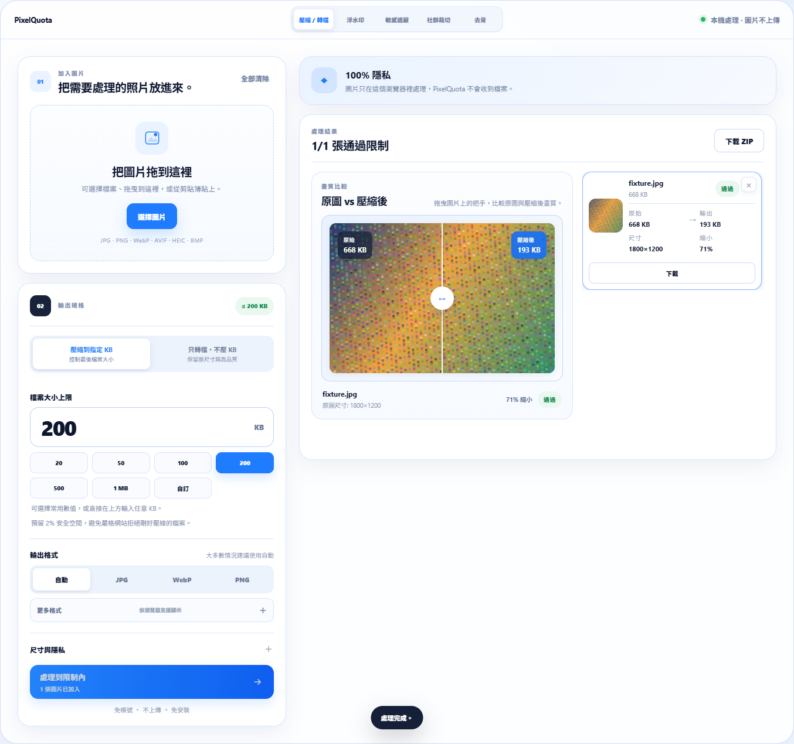
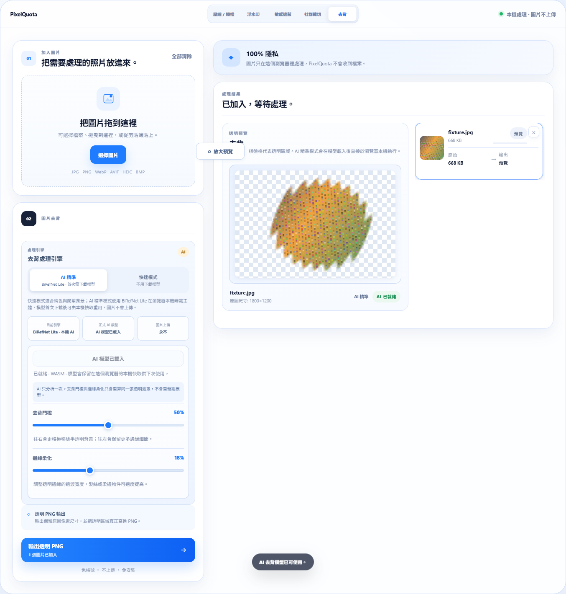
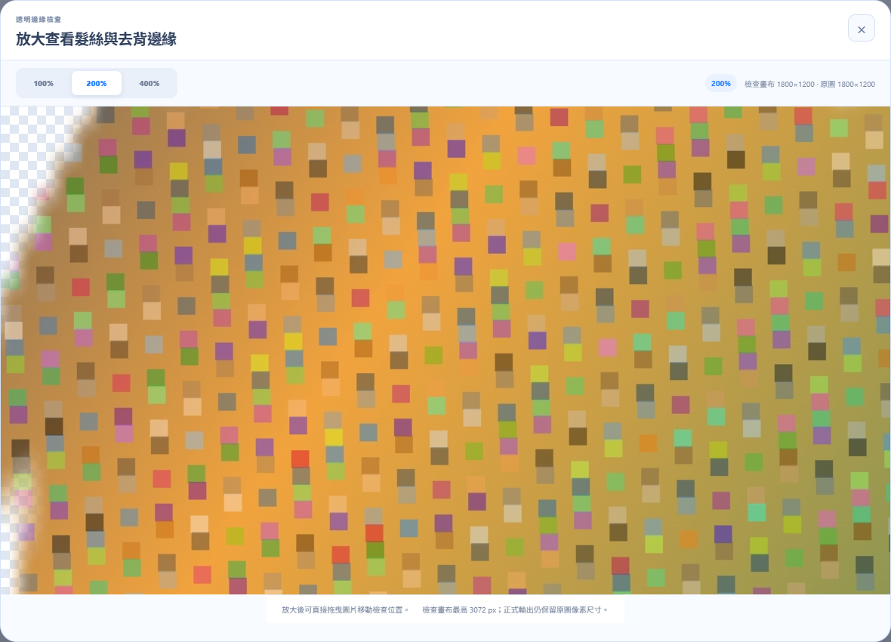

# PixelQuota

<div align="center">

**私密圖片工具，直接在你的瀏覽器裡完成。**

壓縮、轉檔、浮水印、敏感遮蔽、社群裁切與 AI 去背，都不需要把圖片檔案上傳到 PixelQuota。

[**線上直接使用**](https://kane1a.github.io/PixelQuota/) · [English](README.md) · [更新日誌](CHANGELOG.md) · [隱私](#隱私) · [參與貢獻](CONTRIBUTING.md)


</div>



## 五個工具，一套本機工作流程

| 工具 | 功能 |
| --- | --- |
| 壓縮 / 轉檔 | 壓到真正的 KB 上限、設定精確或最大像素尺寸，也可以只轉格式、不強迫壓縮。 |
| 浮水印 | 文字與圖片浮水印可同時使用，支援即時預覽、位置、透明度、大小、對齊與原尺寸輸出。 |
| 敏感遮蔽 | 畫出像素化、模糊或實色遮蔽區域，可移動、縮放、復原 / 重作，輸出後還能比較前後差異再繼續編輯。 |
| 社群裁切 | 先選平台尺寸，再由使用者自己決定裁切框與構圖，不用接受預設焦點。 |
| 去背 | 可用快速模式或 BiRefNet Lite AI，調整透明邊緣，並用放大預覽檢查髮絲與細小邊界。 |

## 專門處理那些很煩的上傳限制

PixelQuota 仍保留最初最重要的能力：處理 **「100 KB 以下」**、**「600×600 px」**、**「只能 JPG」** 這類嚴格表單。它會檢查真正輸出的位元組大小，在限制內尋找盡可能好的結果；如果 KB、格式與尺寸真的無法同時滿足，也會直接說明原因。

「只轉檔」與 KB 壓縮是兩個獨立模式，因此只是需要 JPG / PNG / WebP / AVIF / BMP 的使用者，不必為了改格式被迫降低檔案大小。

## 本機 AI 去背

AI 精準模式使用 **BiRefNet Lite 512** 在瀏覽器內執行。第一次使用時，瀏覽器會下載模型檔並存入 IndexedDB 本機快取；之後重新整理頁面，可直接從快取重新載入，不需要再次下載整份模型權重。

隱私界線很明確：**模型檔可以使用網路，使用者選擇的圖片 bytes 不會上傳。** PixelQuota 不會把圖片送到遠端推論 API。

BiRefNet Lite 會產生固定尺寸的 alpha matte。PixelQuota 會重用同一張 matte 進行去背門檻與邊緣柔化調整，不會每拖一次滑桿就重新跑 AI；正式輸出時，再以原圖像素尺寸合成透明 PNG。放大預覽同樣沿用既有 matte，不會觸發第二次 AI 推論。

<table>
<tr>
<td width="50%"></td>
<td width="50%"></td>
</tr>
</table>

## 格式支援

**輸入：** 支援瀏覽器可解碼的常見圖片格式，並另外提供 HEIC / HEIF 轉換支援。目前主流瀏覽器通常可處理 JPG、PNG、WebP、AVIF、BMP；實際解碼能力仍可能依瀏覽器而不同。

**輸出：** JPG、PNG、WebP、BMP，以及在目前瀏覽器真的能編碼時才啟用的 AVIF。PixelQuota 會先檢查 AVIF 能力，不會不支援時偷偷輸出成別的格式；也可以使用自動格式。

HEIC / HEIF 解碼使用 `heic2any`，ZIP 打包使用 `fflate`。

## 隱私

- 沒有圖片上傳 API。
- 不需要帳號。
- 壓縮、轉檔、浮水印、遮蔽、裁切、預覽、ZIP 與去背合成都在裝置本機完成。
- AI 去背第一次可能需要下載模型檔，但圖片 bytes 仍留在本機。
- 重新編碼的輸出可移除 EXIF / GPS 中繼資料。
- 選用廣告或贊助設定與使用者選取的圖片檔案分離。

使用者介面的完整說明可查看 [Privacy 頁面](https://kane1a.github.io/PixelQuota/privacy.html)。

## 快速開始

```bash
npm ci
npm run dev
```

接著開啟終端機顯示的 Vite 本機網址。

### 建立正式版本

```bash
npm run build
```

Build 會產生：

- `dist/index.html` — 給 GitHub Pages / 靜態網站使用。
- `dist/PixelQuota.html` — 可直接開啟的完整單檔版本。

### 瀏覽器驗證

```bash
npm run test:e2e
```

Chrome / Chromium 測試會驗證壓縮、純轉檔、格式能力檢查、浮水印、遮蔽編輯 / 比較、手動社群裁切、去背、AI matte 重用、模型狀態、放大預覽、下載、響應式版面與多語系。

Chrome / Chromium 不在常見安裝位置時，可設定 `CHROME_PATH`。

## GitHub Pages

公開版本：**https://kane1a.github.io/PixelQuota/**。

Repository 透過 `.github/workflows/pages.yml` 部署；push 到 `main` 後會自動 build 並發布 `dist/`。

## 專案結構

```text
src/                 App 與圖片處理引擎
public/              靜態設定與隱私頁
scripts/             Production / 單檔打包
tests/               瀏覽器端到端驗證
docs/images/         README 精簡截圖
.github/             CI、Pages、Issue 與 PR 模板
```

## 參與貢獻

歡迎 Issue 與 Pull Request，請先閱讀 [CONTRIBUTING.md](CONTRIBUTING.md)。

請**不要在公開 Issue 上傳身分證件、申請文件、證書、醫療影像或其他敏感圖片**；請改用不含私人資訊的測試圖片重現問題。

## 授權

PixelQuota 採用 [MIT License](LICENSE)。
