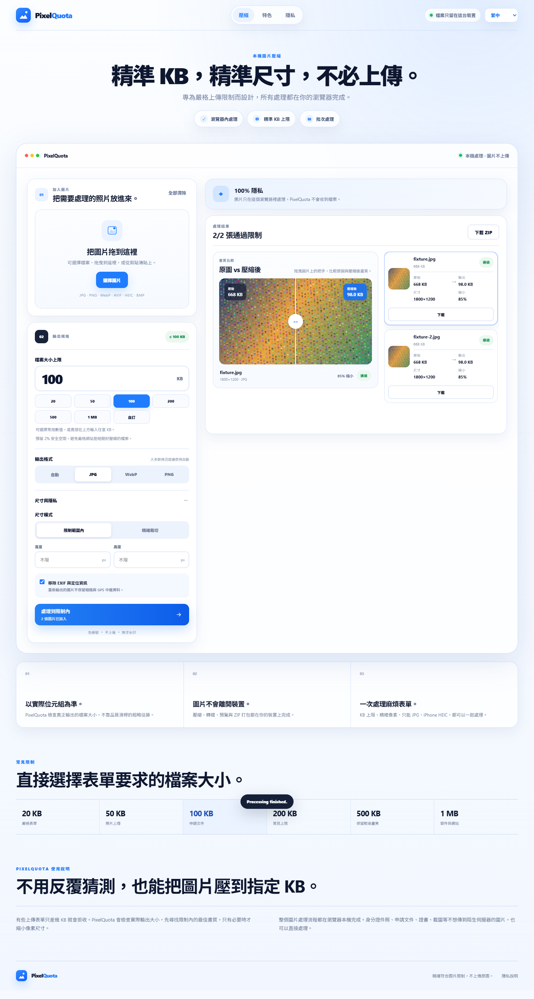
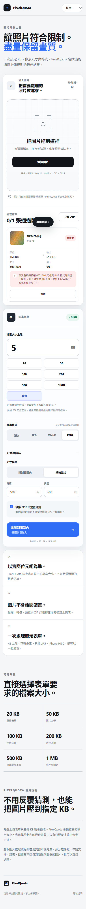

# PixelQuota

<div align="center">

**精確符合圖片上傳限制，而且不需要把圖片上傳到伺服器。**

可依指定 **KB 大小**壓縮、設定精確**像素尺寸**、轉換格式、批次處理，整個圖片流程都在瀏覽器本機完成。

[**線上直接使用**](https://kane1a.github.io/PixelQuota/) · [English](README.md) · [快速開始](#快速開始) · [隱私](#隱私) · [參與貢獻](CONTRIBUTING.md)


</div>



## 為什麼需要 PixelQuota？

很多圖片壓縮工具以「畫質滑桿」為核心，但實際的上傳表單通常不是這樣要求。

政府網站、求職申請、學校表單、證件照系統、Email 或 CMS 常見的限制是 **「100 KB 以下」**、**「必須 600×600 px」**、**「只能 JPG」**。PixelQuota 從一開始就是以這些條件為核心設計。

它會檢查**真正輸出的位元組大小**，在限制內尋找盡可能高的畫質；如果指定條件真的無法同時達成，也會直接說明原因，不會偷偷改掉你要求的尺寸。

## 主要功能

| 功能 | 說明 |
| --- | --- |
| 精確 KB 上限 | 依指定大小壓縮，並預留 2% 安全空間，降低嚴格表單拒收壓線檔案的機率。 |
| 自訂大小 | 可用 20 / 50 / 100 / 200 / 500 KB / 1 MB，也能輸入任何 KB。 |
| 精確尺寸 | 可要求固定像素尺寸，或限制最大寬高。 |
| 明確錯誤原因 | 無法同時符合 KB、格式、尺寸時，會說明是哪個條件造成限制。 |
| 本機隱私處理 | 圖片位元組留在瀏覽器內，PixelQuota 沒有圖片上傳 API。 |
| 批次處理 | 單次最多 30 張圖片，完成後可一次下載 ZIP。 |
| 格式轉換 | 輸入支援 JPG、PNG、WebP、AVIF、HEIC/HEIF、BMP；輸出可選 JPG、PNG、WebP 或自動。 |
| 移除中繼資料 | 重新輸出的圖片可移除 EXIF 與定位資訊。 |
| 防止重複亂按 | 相同設定再次按處理會自動略過；只有設定變更才會從原始圖片重新處理。 |
| 英文 + 繁體中文 | 靜態文字、動態狀態與錯誤原因都完整雙語化。 |
| 單檔離線版本 | `dist/PixelQuota.html` 可直接雙擊開啟，不需要本機伺服器。 |

## 畫面

<table>
<tr>
<td width="72%"></td>
<td width="28%"></td>
</tr>
</table>

## 快速開始

```bash
npm ci
npm run dev
```

接著開啟終端機顯示的 Vite 本機網址。

### 建立正式版本

```bash
npm run build
```

Build 後會產生兩種入口：

- `dist/index.html` — 給靜態網站與 GitHub Pages 使用。
- `dist/PixelQuota.html` — 完整單檔版本，可直接雙擊使用。

### 瀏覽器測試

```bash
npm run test:e2e
```

測試會直接開啟正式 Build，驗證中英文切換、常用與自訂 KB、重複處理保護、設定變更後重新處理、在地化錯誤原因、下載、響應式版面，以及中英文斷行與排版。

如果 Chrome 不在常見安裝位置，可先設定 `CHROME_PATH`。

## GitHub Pages

線上版本：**https://kane1a.github.io/PixelQuota/**。

Repository 透過 `.github/workflows/pages.yml` 自動部署；之後每次 push 到 `main`，GitHub 都會自動 build 並發布 `dist/`。

## 運作方式

PixelQuota 使用瀏覽器圖片 API 進行解碼與重新編碼，再依目標位元組大小搜尋合適的輸出畫質。如果只降低畫質仍無法達標，在非精確尺寸模式下才會逐步縮小像素尺寸。

精確尺寸模式會把寬高視為硬性條件；若 KB、格式與尺寸無法同時達成，就直接顯示原因。

HEIC/HEIF 解碼使用 `heic2any`，ZIP 打包使用 `fflate`。

## 隱私

PixelQuota 的圖片處理路徑設計為完全在瀏覽器本機執行。

- 沒有圖片上傳 API。
- 不需要帳號。
- 不加浮水印。
- 選取的圖片位元組不會傳送給 PixelQuota。
- 未來若啟用廣告或贊助，設定也與圖片處理路徑分離。

如果處理的是敏感證件或文件，仍建議確認你執行工具的環境；高敏感用途也可以直接檢查本專案原始碼。

## 專案結構

```text
src/                 App 邏輯、壓縮引擎、翻譯、樣式
public/              靜態設定與隱私頁
scripts/             Production build 後處理
tests/               瀏覽器端到端測試
docs/images/         README 畫面截圖
.github/             CI、Pages、Issue 與 PR 模板
```

## 參與貢獻

歡迎 Issue 與 Pull Request，請先閱讀 [CONTRIBUTING.md](CONTRIBUTING.md)。

請**不要在公開 Issue 上傳身分證件照、申請文件、證書或其他敏感圖片**；請改用不含私人資訊的測試圖片重現問題。

## 授權

PixelQuota 採用 [MIT License](LICENSE)。
